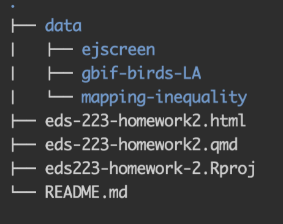

# eds223-homework-2: Redlining and Environmental Injustice in LA Counties

Homework 2 for EDS 223, in which we will examine redlining in Los Angeles Counties

This repo structure:

# Data access

All data was publicly available and cited. For data use please see references section.

# Author

-   Peter Vitale (Author) \# References

#### Data

United States Environmental Protection Agency. 2015. EJSCREEN. Retrieved: November 5th 2025 from [epa.gov](www.epa.gov/ejscreen)

Nelson, Robert K., LaDale Winling, et al. "Mapping Inequality: Redlining in New Deal America." Edited by Robert K. Nelson. American Panorama: An Atlas of United States History, 2023. Retrieved: October 16th 2025 from [https://dsl.richmond.edu/panorama/redlining](https://dsl.richmond.edu/panorama/redlining/data)

GBIF: The Global Biodiversity Information Facility (2021) GBIF. Retrieved: October 16th 2025 from (<https://www.gbif.org/>)
